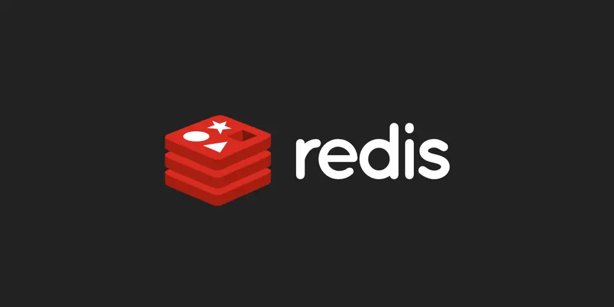

# Redis & RedisInsight 🛠️

Esta stack inclui **Redis**, um banco de dados em memória super-rápido e versátil, perfeito para caching, mensageria, e outras aplicações de alta performance, e **RedisInsight**, uma poderosa ferramenta GUI para gerenciar e visualizar seus dados no Redis. Todos os comandos devem ser executados na raiz do diretório da stack.

```sh
# Criar a stack
# ---
$ docker-compose up -d
```
```sh
# Destruir a stack
# ---
$ docker-compose down
```
```sh
# Executar script de carga e validação de dados
# O script insert.py permite ajustar a quantidade de chaves e dados inseridos.
# ---
$ ./setup-env.sh
$ source venv/bin/activate
$ ./insert.py
$ deactivate
```

## Observações
O virtualenv só precisa ser criado 1 vez. Caso ele já exista, basta ativá-lo ( source venv/bin/activate ), executar o script ( ./insert.py ) e desativá-lo ( deactivate ). O Script de insert, cria uma HASH Key com payload JSON como o abaixo, de forma aleatória, na quantidade definida na variável ___num_records___.

```json
"isSuccess":true
"isTechnicalError":false
"timestamp":{
    "date":{
        "year":2024,
        "month":7,
        "day":4
    },
    "time":{
        "hour":10,
        "minute":44,
        "second":8,
        "nano":131036000}
    }
}
```

---
🔔 Atenção: O RedisInsight é ideal para ambientes de desenvolvimento e monitoramento, mas deve ser usado com cuidado em produção para evitar impactos no desempenho. Garanta que as configurações de segurança estejam devidamente ajustadas!